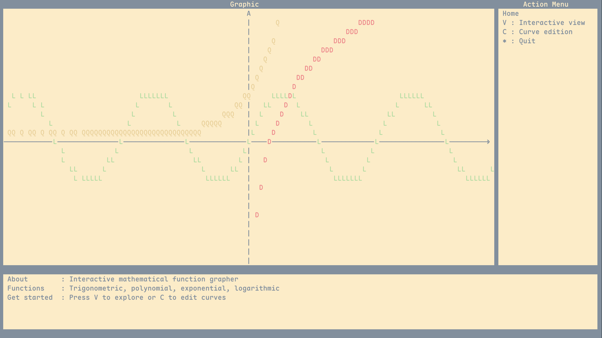
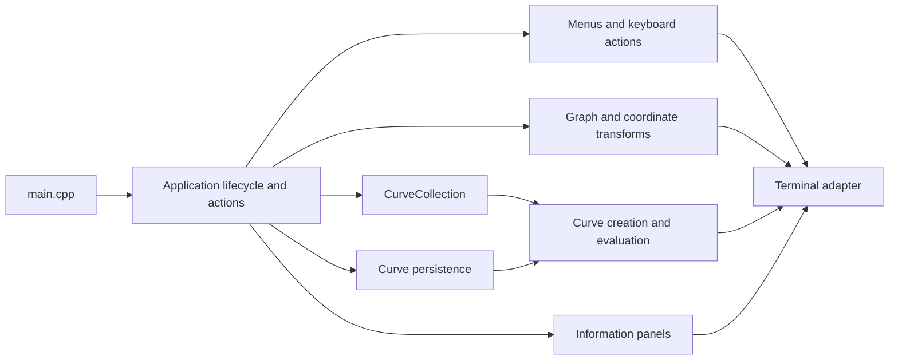

# Graphite

[](https://github.com/duclosjulien/graphite/actions/workflows/verify.yml)

Graphite is an interactive terminal function grapher written in C++20.

It lets you create and display different types of curves directly in the terminal, then modify their parameters interactively.



## Features

- Plot multiple curves at the same time
- Create sine, cosine, tangent, polynomial, exponential, and logarithmic curves
- Modify curve parameters interactively
- Pan and zoom the graph
- Save and restore curves between sessions
- Run on macOS and Linux terminals

## Controls

- Home mode
  - `V`: Open the interactive view
  - `C`: Open curve editing
  - `Esc` or `*`: Quit

- Interactive view
  - Arrow keys: Pan the graph
  - `R`: Reset the view
  - `E` / `Q`: Zoom in or out
  - `W` / `S`: Zoom the Y axis
  - `D` / `A`: Zoom the X axis
  - `Esc` or `*`: Return home

- Curve editing
  - Up / Down: Select the previous or next curve
  - Left / Right: Select the first or last curve
  - `S`, `C`, `T`, `P`, `E`, `L`: Add a curve
  - `Z`: Show all curves
  - `X`: Show only the selected curve
  - `#`: Remove the selected curve
  - `1–9`: Select a parameter
  - `+` / `-`: Adjust the selected parameter
  - `Esc` or `*`: Return home

## Requirements

- C++20-compatible compiler
- CMake 3.19 or newer
- macOS or Linux
- ANSI-compatible terminal
- Minimum terminal size of 118 columns by 29 rows

Graphite detects the terminal size when it starts and adapts the layout to larger terminals. If you resize the terminal while Graphite is running, restart the app to update the layout.

Windows is not currently supported.

## Build

```bash
git clone https://github.com/duclosjulien/graphite.git
cd graphite

cmake -S . -B build
cmake --build build
```

Then run:

```bash
./build/graphite
```

## Tests

Configure, build, and run the tests with:

```bash
cmake -S . -B build -DBUILD_TESTING=ON
cmake --build build --parallel
ctest --test-dir build --output-on-failure
```

Graphite uses Catch2 and CTest. GitHub Actions verifies warning-clean builds with GCC and Clang and runs AddressSanitizer and UndefinedBehaviorSanitizer checks.

## Architecture



## Roadmap

### Core application

- Interactive terminal UI with multiple application modes
- Keyboard-driven menus and controls
- Plotting and editing of six curve types
- Independent graph panning and zooming
- Multiple-curve creation, selection, and display

### Modernization completed

- Updated the project to C++20 and target-based CMake
- Replaced manual curve memory management with standard containers and RAII
- Replaced the custom linked list with an encapsulated curve collection
- Added automated tests, compiler warnings, CI, and sanitizers
- Added validated curve persistence
- Added terminal-size detection and adaptive layout
- Replaced Windows keyboard handling with POSIX terminal input

### Planned

- Continue applying modern C++ practices to the remaining legacy interfaces
- Separate application actions from the interactive loop
- Separate mathematical curve logic from terminal rendering
- Restore terminal state automatically after failures
- Improve rendering of steep curves and discontinuities

## License

Graphite is available under the [MIT License](LICENSE).